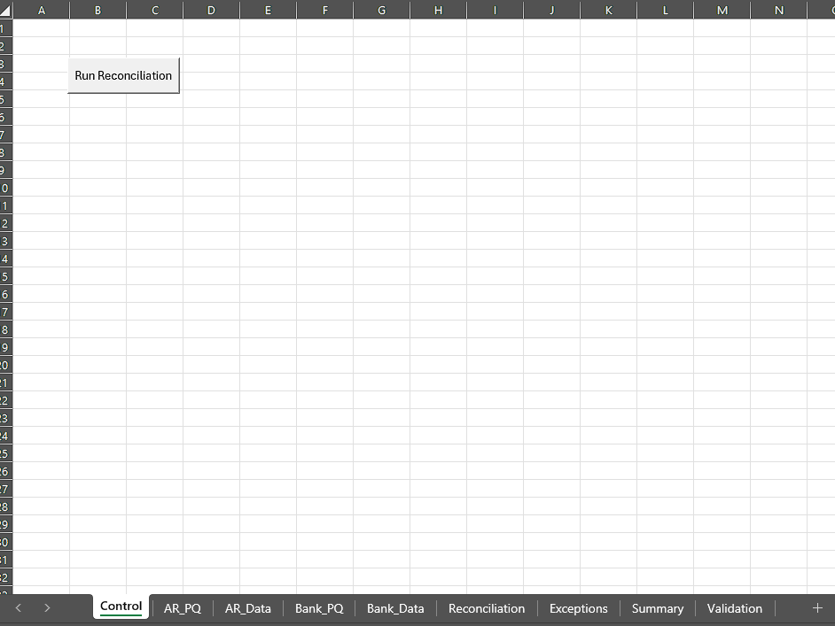
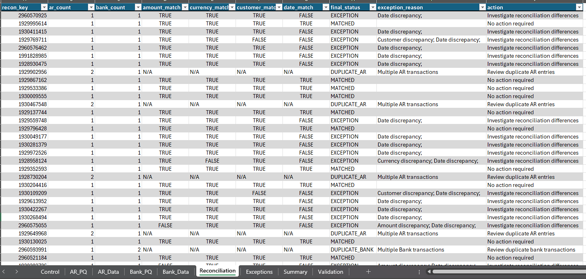
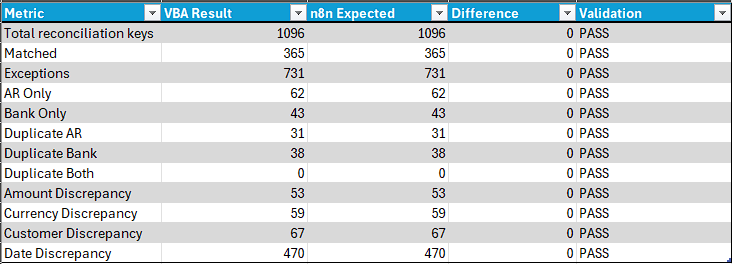
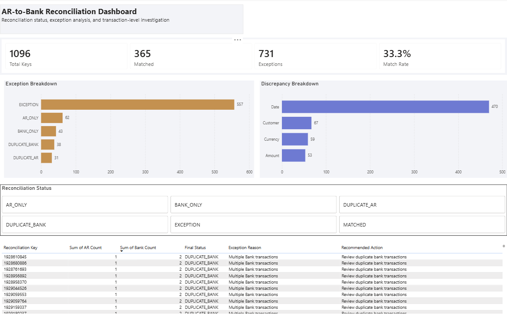
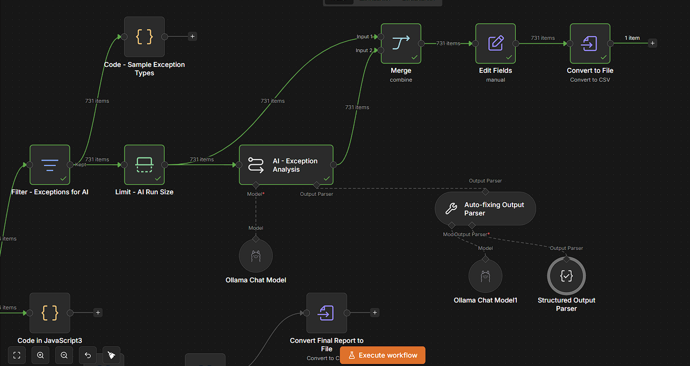

# AI-Assisted AR-to-Bank Reconciliation Automation

A personal finance automation project exploring how repetitive AR-to-bank reconciliation activities can be standardized, automated, and supported by AI-assisted exception analysis.

The project compares AR Ledger and Bank Remittance data using deterministic reconciliation rules, identifies matched transactions and exceptions, validates the results, and uses a locally hosted LLM to analyze exceptions, suggest likely causes, assign investigation priorities, and recommend next actions.

## Project Objective

The goal was to build a practical reconciliation prototype that can:

- Compare transactions from two financial data sources
- Match transactions using a reconciliation key
- Detect transactions existing in only one source
- Identify duplicate transactions
- Compare amount, currency, customer/payer, and transaction date
- Apply a ±1-day date tolerance
- Classify matched transactions and exceptions
- Provide exception reasons and recommended actions
- Validate the automated results against a controlled answer key after deterministic reconciliation
- Use AI to assist with exception analysis after deterministic reconciliation
- Generate structured likely-cause assessments, investigation priorities, recommended actions, explanations, and confidence levels

All data used in the project is synthetic and was created specifically for testing and demonstration.

## Implementations

The project was developed through several complementary implementations and layers, each serving a different purpose in the overall reconciliation process.

### 1. n8n + JavaScript

The original prototype was developed in n8n using JavaScript Code nodes.

The workflow:

1. Reads AR Ledger and Bank Remittance data
2. Standardizes both sources into a common structure
3. Groups transactions using a reconciliation key
4. Applies deterministic reconciliation rules
5. Identifies matched transactions and reconciliation exceptions
6. Validates results against a controlled answer key
7. Generates reconciliation and summary outputs
8. Filters identified exceptions for AI-assisted analysis
9. Uses a locally hosted LLM to suggest likely causes, investigation priorities, recommended actions, explanations, and confidence levels
10. Generates a structured AI-assisted exception report

### 2. Excel Power Query + VBA

The reconciliation was subsequently recreated in Excel to explore how the same process could be implemented using tools commonly used in Finance teams.

**Power Query** is used to:

- Prepare the AR and Bank datasets
- Standardize column structures
- Apply appropriate data types
- Perform basic text cleaning

**VBA** is used to:

- Group transactions by reconciliation key
- Detect duplicate and one-sided transactions
- Compare reconciliation attributes
- Apply the ±1-day date tolerance
- Classify exceptions
- Assign investigation status for identified exceptions
- Validate the final results

A `Run Reconciliation` button executes the VBA reconciliation process using the standardized Power Query outputs.

## Reconciliation Logic

Transactions are evaluated based on:

- Reconciliation Key
- Amount
- Currency
- Customer / Payer
- Transaction Date

Structural exceptions include:

- AR Only
- Bank Only
- Duplicate AR
- Duplicate Bank
- Duplicate in Both Sources

For normal 1-to-1 transactions, the remaining reconciliation attributes are compared before the transaction is classified as either `MATCHED` or `EXCEPTION`.

## Validation Results

The deterministic n8n and Excel implementations were tested using the same controlled dataset and reconciliation rules.

| Metric | Result |
|---|---:|
| Total Reconciliation Keys | 1,096 |
| Matched | 365 |
| Exceptions | 731 |
| AR Only | 62 |
| Bank Only | 43 |
| Duplicate AR | 31 |
| Duplicate Bank | 38 |
| Duplicate Both | 0 |
| Amount Discrepancy | 53 |
| Currency Discrepancy | 59 |
| Customer Discrepancy | 67 |
| Date Discrepancy | 470 |

The Excel Power Query + VBA implementation reproduced the validated n8n results across all tracked reconciliation metrics.

All 731 reconciliation exceptions were subsequently processed through the AI-assisted exception analysis layer. The locally hosted LLM generated structured outputs for likely cause, investigation priority, recommended action, explanation, and confidence level without changing the underlying deterministic reconciliation status.

## Project Screenshots

### Excel Reconciliation Control

The Excel implementation uses Power Query for data preparation and VBA for the reconciliation process.

### Reconciliation Output

The reconciliation output identifies matched records, structural exceptions, field-level discrepancies, exception reasons, and investigation status.

### Validation Results

The Excel Power Query + VBA implementation was validated against the same expected results used for the n8n implementation.

## Power BI Dashboard

The validated reconciliation output was also used as the data source for a one-page Power BI dashboard.

The dashboard provides:

- Total reconciliation keys
- Matched and exception counts
- Match rate
- Exception breakdown
- Discrepancy analysis
- Interactive reconciliation-status filtering
- Transaction-level investigation details

This extends the project from reconciliation automation into management reporting and exception analysis.

### AI-Assisted Exception Analysis

Reconciliation exceptions identified by the deterministic workflow are passed to a locally hosted LLM using Ollama and Qwen3 8B.

The AI layer provides structured decision-support fields for each exception:

- Likely cause
- Investigation priority
- Recommended action
- Explanation
- Confidence level

The AI layer does not determine whether a transaction is matched or an exception. Reconciliation status remains controlled by the deterministic reconciliation rules.

- Microsoft Excel
- Power Query
- VBA
- Power BI
- n8n
- JavaScript
- Docker
- Ollama
- Qwen3 8B
- CSV
- GitHub

## Project Scope

This is a personal proof-of-concept using controlled synthetic data.

The objective is not to represent a production reconciliation system, but to demonstrate how repetitive reconciliation activities can be standardized, automated, validated, visualized, and supported by AI-assisted exception analysis.

The core reconciliation logic remains deterministic to maintain consistency, auditability, and explainability. AI is applied only after exceptions have been identified and is used as decision support for likely-cause analysis, investigation priority, recommended actions, explanations, and confidence levels.

AI-generated outputs should be treated as investigation assistance rather than confirmed accounting conclusions.

## Key Limitations

- The project uses synthetic data and is not connected to live ERP or banking systems.
- The ±1-day date tolerance and other reconciliation rules are demonstration business rules.
- AI-generated recommendations may vary and require human review.
- The locally hosted LLM assists with exception investigation but does not alter reconciliation classifications.
